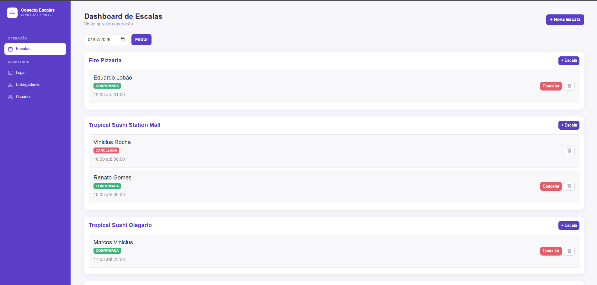

# Motoboy Management System 🛵


## 📌 Sobre o Projeto

Sistema web desenvolvido com **Java e Spring Boot** para gerenciamento de escalas de motoboys.

O projeto foi idealizado a partir de desafios observados em operações logísticas reais, buscando centralizar o controle de escalas, organizar a distribuição de entregadores entre lojas e facilitar a visualização operacional diária.

Além da API REST, o sistema possui interface web desenvolvida com **Thymeleaf e Bootstrap**, permitindo o gerenciamento das escalas de forma simples e intuitiva.

---

## 🚀 Tecnologias Utilizadas

- Java 17
- Spring Boot
- Spring Web
- Spring Data JPA
- Spring Security
- Hibernate
- MySQL
- Thymeleaf
- Bootstrap
- Maven
- Swagger/OpenAPI
- Lombok
- Git e GitHub

---

## 🧩 Funcionalidades

### Gestão de Escalas
- Cadastro de escalas
- Cancelamento de escalas
- Exclusão de escalas
- Controle de horários de trabalho
- Associação entre motoboys e lojas

### Dashboard Operacional
- Visualização de escalas por data
- Agrupamento das escalas por loja
- Consulta rápida da operação diária

### API REST
- CRUD de Motoboys
- CRUD de Lojas
- CRUD de Escalas
- Documentação automática com Swagger

---

## 🔐 Segurança

- Autenticação com Spring Security
- Tela de login personalizada
- Proteção de rotas da aplicação
- Controle de sessão
- Criptografia de senhas com BCrypt
- Redirecionamento automático para autenticação em áreas protegidas

 ## ✅ Boas Práticas Implementadas

- Arquitetura em camadas (Controller, Service e Repository)
- DTOs para transferência de dados
- Bean Validation para validação de entradas
- Tratamento global de exceções com ControllerAdvice
- Documentação automática com Swagger/OpenAPI
- Separação de responsabilidades seguindo boas práticas do Spring Boot

## 🏗️ Arquitetura

O projeto segue arquitetura em camadas para facilitar manutenção, escalabilidade e organização do código.

- controller → Recebe e processa as requisições HTTP
- service → Regras de negócio da aplicação
- repository → Acesso aos dados com Spring Data JPA
- dto → Transferência de dados entre camadas
- model → Entidades do domínio
- security → Configurações de autenticação e autorização
- exception → Tratamento global de exceções

---

## 📖 Documentação da API

Com a aplicação em execução:

```bash
http://localhost:8080/swagger-ui.html
```

---

## ▶️ Executando o Projeto

### Pré-requisitos

- Java 17+
- Maven
- MySQL

### Execução

```bash
git clone https://github.com/seuusuario/motoboy-management-system.git

cd motoboy-management-system

./mvnw spring-boot:run
```

Aplicação disponível em:

```bash
http://localhost:8080
```

---

## 📸 Demonstração do Sistema

<h3>Tela de Login</h3>

<p align="center">
  
</p>

<h3>Lista de Escalas</h3>

<p align="center">
  
</p>

<p align="center">
  <em>Visualização centralizada das escalas cadastradas, permitindo consulta e gerenciamento dos registros.</em>
</p>

<p align="center">
  <em>Formulário para cadastro de novas escalas com seleção de motoboy, data e horário.</em>
</p>

## 📌 Status

Versão 1.1 concluída.

Principais funcionalidades implementadas:

- Gestão de escalas
- API REST
- Interface Web com Thymeleaf
- Spring Security
- Bean Validation
- Tratamento global de exceções
- Swagger/OpenAPI

---

Sistema desenvolvido para apoiar a gestão operacional de escalas em operações de entrega, centralizando informações de lojas, motoboys e jornadas de trabalho.
