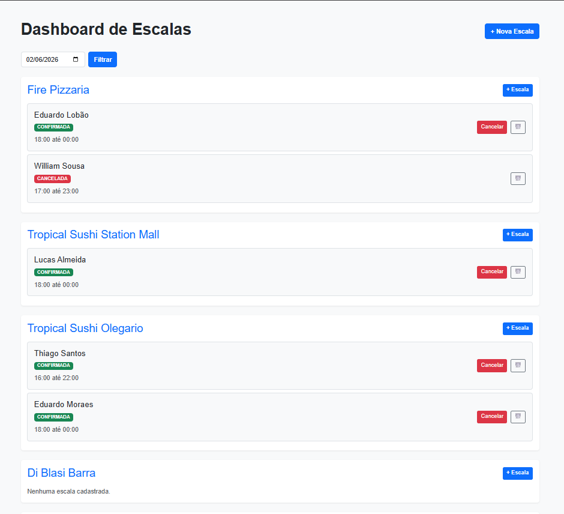
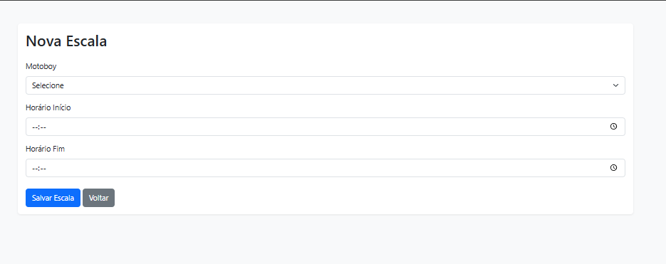

# Motoboy Management System 🛵


## 📌 Sobre o Projeto

Sistema web desenvolvido com **Java e Spring Boot** para gerenciamento de escalas de motoboys.

O projeto foi idealizado a partir de desafios observados em operações logísticas reais, buscando centralizar o controle de escalas, organizar a distribuição de entregadores entre lojas e facilitar a visualização operacional diária.

Além da API REST, o sistema possui interface web desenvolvida com **Thymeleaf e Bootstrap**, permitindo o gerenciamento das escalas de forma simples e intuitiva.

---

## 🚀 Tecnologias Utilizadas

- Java 17
- Spring Boot
- Spring Web
- Spring Data JPA
- Hibernate
- MySQL
- Thymeleaf
- Bootstrap
- Maven
- Swagger/OpenAPI
- Lombok
- Git e GitHub

---

## 🧩 Funcionalidades

### Gestão de Escalas
- Cadastro de escalas
- Cancelamento de escalas
- Exclusão de escalas
- Controle de horários de trabalho
- Associação entre motoboys e lojas

### Dashboard Operacional
- Visualização de escalas por data
- Agrupamento das escalas por loja
- Consulta rápida da operação diária

### API REST
- CRUD de Motoboys
- CRUD de Lojas
- CRUD de Escalas
- Documentação automática com Swagger

---

## 📋 Regras de Negócio

- Uma loja pode possuir várias escalas.
- Um motoboy pode possuir várias escalas.
- Cada escala pertence a uma loja e a um motoboy.
- Escalas são organizadas por data.
- Escalas podem ser canceladas durante a operação.

---

## 🎯 Objetivo

Este projeto foi desenvolvido para consolidar conhecimentos em:

- Desenvolvimento Backend com Java
- Spring Boot
- APIs REST
- JPA/Hibernate
- Banco de Dados Relacional
- Arquitetura em Camadas
- Modelagem de Entidades e Relacionamentos
- Desenvolvimento de soluções para problemas reais de negócio

---

## 📖 Documentação da API

Com a aplicação em execução:

```bash
http://localhost:8080/swagger-ui.html
```

---

## ▶️ Executando o Projeto

### Pré-requisitos

- Java 17+
- Maven
- MySQL

### Execução

```bash
git clone https://github.com/seuusuario/motoboy-management-system.git

cd motoboy-management-system

./mvnw spring-boot:run
```

Aplicação disponível em:

```bash
http://localhost:8080
```

---

## 📸 Demonstração do Sistema

<h3>Lista de Escalas</h3>

<p align="center">
  
</p>

<p align="center">
  <em>Visualização centralizada das escalas cadastradas, permitindo consulta e gerenciamento dos registros.</em>
</p>

<h3>Nova Escala</h3>

<p align="center">
  
</p>

<p align="center">
  <em>Formulário para cadastro de novas escalas com seleção de motoboy, data e horário.</em>
</p>

## 📌 Status

O sistema encontra-se finalizado em sua versão atual e pronto para utilização. Novas funcionalidades e melhorias poderão ser adicionadas futuramente para melhorar e facilitar o uso.

---

Sistema desenvolvido para apoiar a gestão operacional de escalas em operações de entrega, centralizando informações de lojas, motoboys e jornadas de trabalho.
